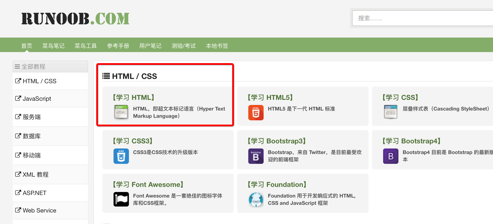
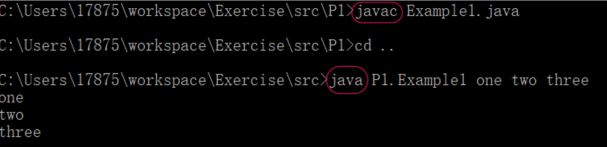
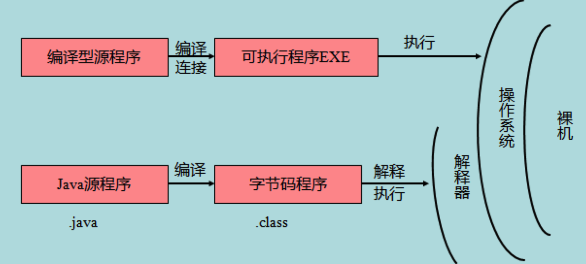
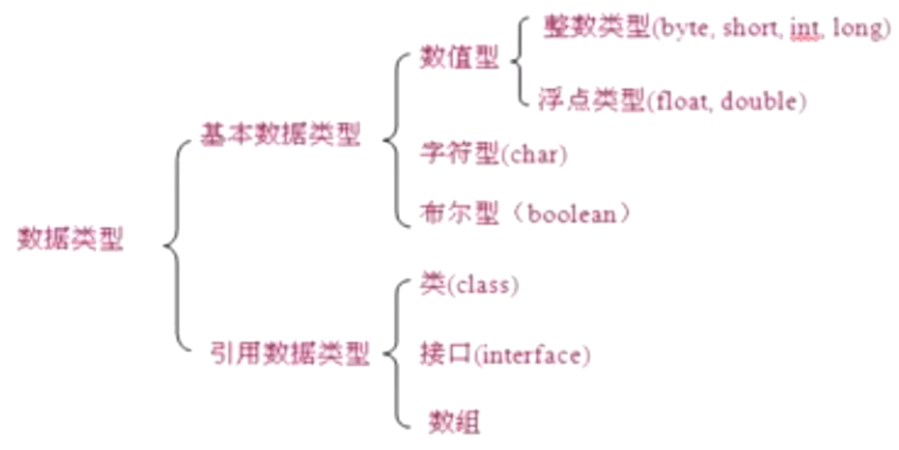
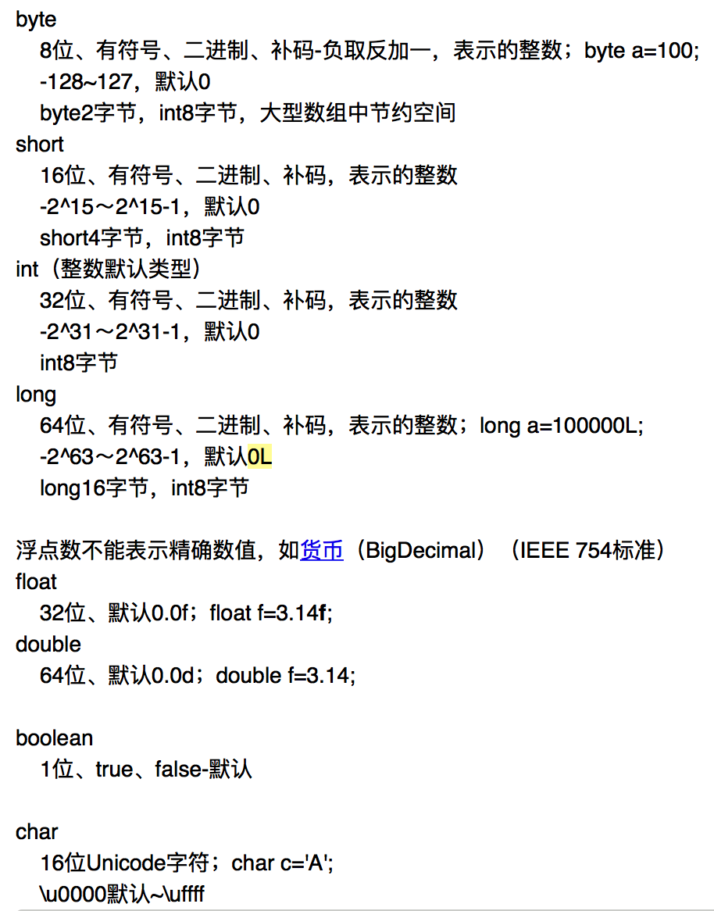
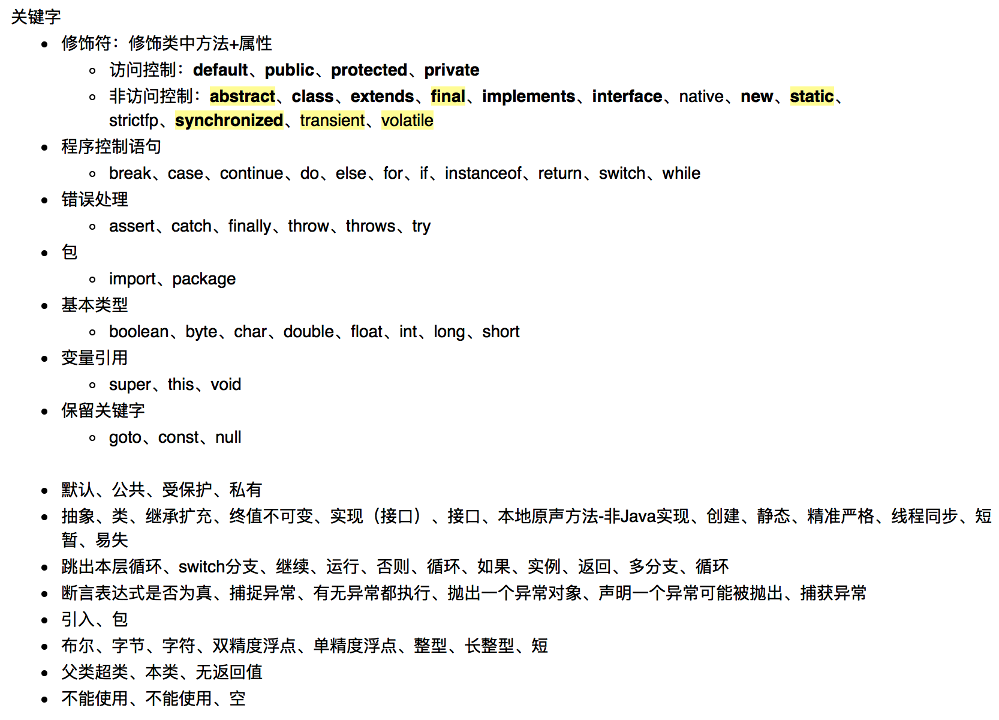
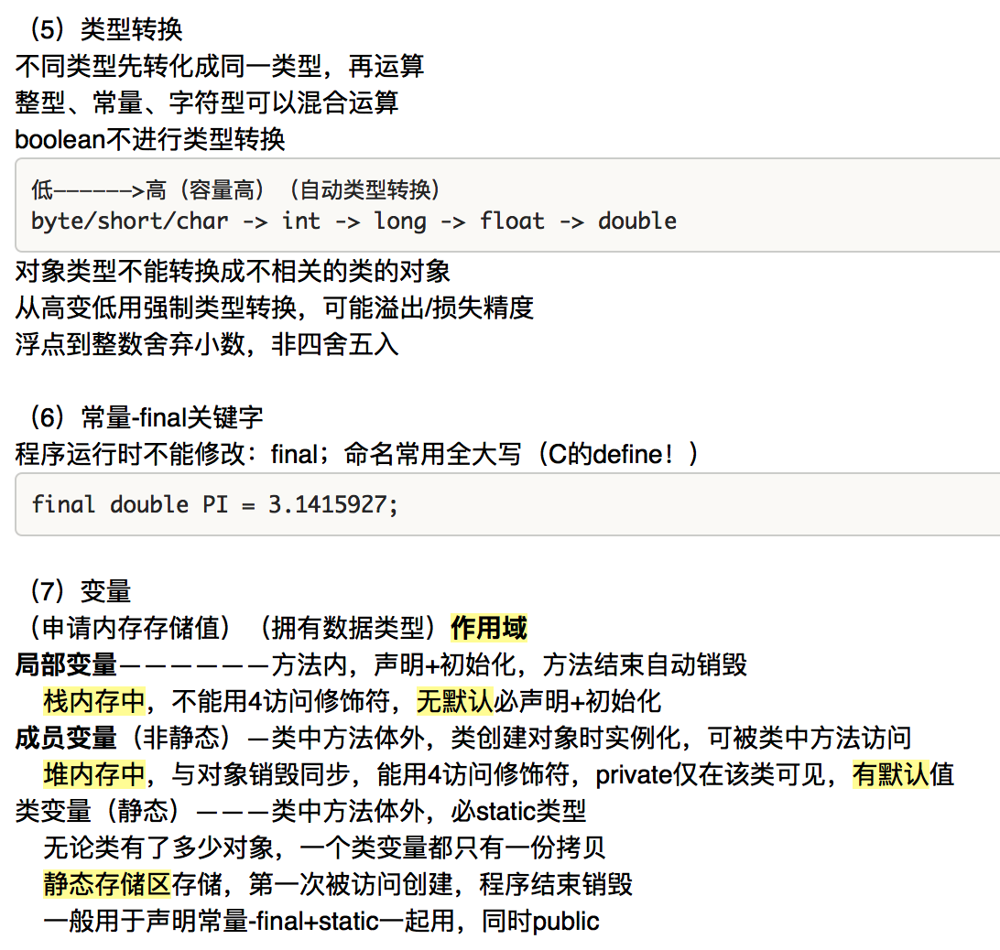

# 下周任务

老师讲的进度，推断期末考试进度

期末题型：选择、填空、手写代码、**名词解释**

菜鸟教程：https://www.runoob.com/

看书+书后题+牛客网做练习

制作网页

# Java

5月：前10章：看书+课后题

## 基础语法

### 1-7章

#### 介绍

IDE：Eclipse、IDEA

Java SE=Java Platform，Standard Edition；桌面、服务器、嵌入式、实时环境，支持EE+ME开发

Java EE=Java Platform，Enterprise Edition；企业级、网站，提供Web服务、组件、管理、通信

Java ME=Java Platform，Micro Edition；移动式设备、嵌入式，用户界面、安全模型、网络协议

JDK=Java Development Kit=Java开发工具包

JRE=Java Runtime Environment=Java运行环境

JVM=Java Virtual Machine=Java虚拟机，连操作系统

Java特点：有JVM，一次编写多处运行

#### JDK

Oracle官网：https://www.oracle.com/index.html

Oracle官网Java API：https://docs.oracle.com/en/java/javase/16/docs/api/index.html

菜鸟教程中文Java API：https://www.runoob.com/manual/jdk11api/index.html

#### HelloWorld.java

去看菜鸟教程-Java教程第一页

#### 数据类型

String是引用类型，属于class

#### 关键字

第7章4个访问控制修饰符

#### 标识符

=类名+变量名+方法名

大小写敏感

字母、$、_、数字（不能开始）

  包名：首小

   源文件名=类名，不同会编译错误

   类名：首字母大写，驼峰命名

   方法名：首小，驼峰

#### 常量、变量、数据类型转换

#### 输入

Scanner类，加头文件

#### 位运算

0001 1

0010 2

0011 3

0100 4

向左移动1位=0001变成了0010=十进制1变成了2=相当于1 *2

向左移动2位=0001变成了0100=十进制1变成了4=相当于1 *2 *2

## 面向对象

8章

## 异常

9章

## I/O

10章