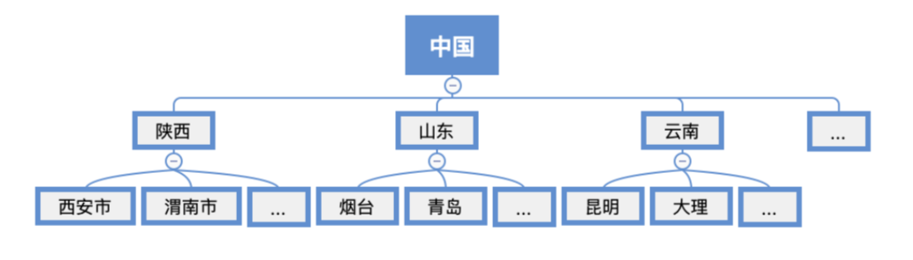

# 树

## 概念



递归的

空树、根结点、边、分支结点、叶子结点、子树

每个结点只有一个前驱

祖先结点、子孙结点、父结点/双亲结点、兄弟结点

路径：从上往下，两个结点之间的

路径长度：经过几条边

树的深度/高度：共几层

树的度：结点度的最大值

结点：层次/深度：从上往下；高度：从下往上

结点：度：有几个孩子/分支

有序树/无序树：子树从左到右，逻辑上

## 性质

结点数=总度数+1（+的是根结点）

树的度（实际最大）、几叉树（只要小于等于）

度为m的树/m叉树：第i层（根-1层）最多m^(i-1)个结点

。。。

## 存储结构

## 遍历

## 二叉树

### 概念

空二叉树、左子树、右子树、有序树、不同于度为2的树

满二叉树：全满了

完全二叉树：最后一层从右开始没有


二叉排序树：左<根<右


平衡二叉树：左右子树高/深度之差不超过1

### 性质

。。。


### 存储结构

TreeNode

顺序存储：数组、完全二叉树序号

TreeNode：data、isEmpty

链式存储：

TreeNode：data、lchild、rchild、(parent)

```
struct TreeNode{
	int data;
	TreeNode *lchild;
	TreeNode *rchild;
	TreeNode *parent;//一般不写
};
```

### 遍历

#### 先序遍历

根左右

xianxu(TreeNode *root){

​	visit(root);//输出当前传入结点的data

​	xianxu(root->lchild);

​	xianxu(root->rchild);

}

#### 中序遍历

左根右

xianxu(TreeNode *root){

​	xianxu(root->lchild);

​	visit(root);//输出当前传入结点的data

​	xianxu(root->rchild);

}

#### 后序遍历

左右根

#### 层次遍历

队列实现

#### 由遍历序列构造二叉树

至少两种序列


#### 线索二叉树

##### 二叉树线索化

##### 找前驱后继

#### 二叉排序树

#### 平衡二叉树

#### 哈夫曼树、哈夫曼编码

#### B树

#### B+树

# 森林

## 概念

互不相交的树、空森林

## 遍历

## 与树的转换

