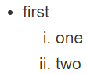
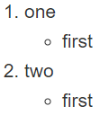

# 常用语法

| 样式 | 说明 | 语法 |
| ---- | ---- | ---- |
| 字体 | *斜体*、**粗体**、***粗斜体*** | `*斜体*`、`**粗体**`、`***粗斜体***` |
| 删除线 | ~~删除线~~ | `~~删除线~~` |
| 下划线 | <u>下划线</u> | `<u>下划线</u>` |
| 标题 | 共6级，按照#数量识别 | `#### 四级标题` |
| 段落 | 空一行来表示新段落/行末尾有2个空格然后换行 |  |
| 分割线 | *和-都可以 | `- - -`、`***` |
| 无序列表 | *、+、- 作为列表标记 | `+ 文本` |
| 有序列表 | 数字加上点 | `1. 文本` |
| 列表嵌套 | 无序、有序都可以包含对方<br>用tab来表示层级关系 |    |
| 引用 | 本身可以嵌套，>越多层数越多<br>若在>后边加5个空格，当前行变成代码段 | `> 文本` |
| 引用与列表嵌套 | 支持相互混合嵌套 |  |
| 代码 | 一个反引号，如果想显示反引号，外层就需要2个反引号包裹 | `` `文本` `` |
| 代码段 | 三个反引号包裹，可以指定语言 | `` ```java ``<br>`` public static void main(String args[]) { ``<br>`` System.out.println("Hello World!"); ``<br>`` } ``<br>`` ``` `` |
| 脚注 | 我有一个脚注[^1] | 随意位置加上：`[^id]`<br>随意位置写统一显示在最后：`[^id]:balabala`|
| 链接 | [百度](http://www.baidu.com)、<http://www.baidu.com> | `[链接名称](链接地址)`、`<链接地址>` |
| 链接统一赋值 | [百度][百度链接] | 文中使用：`[链接名称][id]`<br>文末统一：`[id]:链接地址` |
| 图片 | 图片标题可以不写 | `` |
| 图片标签 | 可以自定义宽高等属性 | `` |
| 表格 | `英文竖线`分隔格子，`-`分隔表头和其他行<br>分隔表头的行可以设置整列的对其方式 | `语法见Line45～47` |
| 转义 | 可能涉及到的字符：<br>\\  反斜线<br>\`  反引号<br>\*  星号<br>\_  下划线<br>\{\} 花括号<br>\[\] 方括号<br>\(\) 小括号<br>\#  井字号<br>\+  加号<br>\-  减号<br>\.  英文句点<br>\!  感叹号 | 反斜杠`\` |

### 展示:
#### 四级标题
- - -
[^1]:我是一个脚注哦~

> 引用1
>> 引用2
>>>     代码行

```java
public class HelloWorld {
    public static void main(String[] args) {
        System.out.println("HelloWorld");
    }
}
```

[百度链接]:http://www.baidu.com

| 左对齐 | 右对齐 | 居中对齐 |
|:-|-:|:-:|
| 格子 | 格子 | 单元格 |

# 常用HTML标签
######`<br>`：换行
######`<kbd></kbd>`：<kbd>123</kbd>
######`<b></b>`：<b>123</b>
######`<i></i>`：<i>123</i>
######`<em></em>`：<em>123</em>
######`<sub></sub>`：123<sub>123</sub>
######`<sup></sup>`：123<sup>123</sup>
######`<font color="red">123</font>`：<font color="red">123</font>

# 参考
[菜鸟教程](https://www.runoob.com/markdown/md-tutorial.html)

# 作者的话
+ 【20191126】第二版，选择了表格式，希望一眼就看到需要的格式，作为笔记使用最佳
+ 【20180212】第一版，根据简书上的一个教程写的，只是简单的罗列，看着非常不整齐